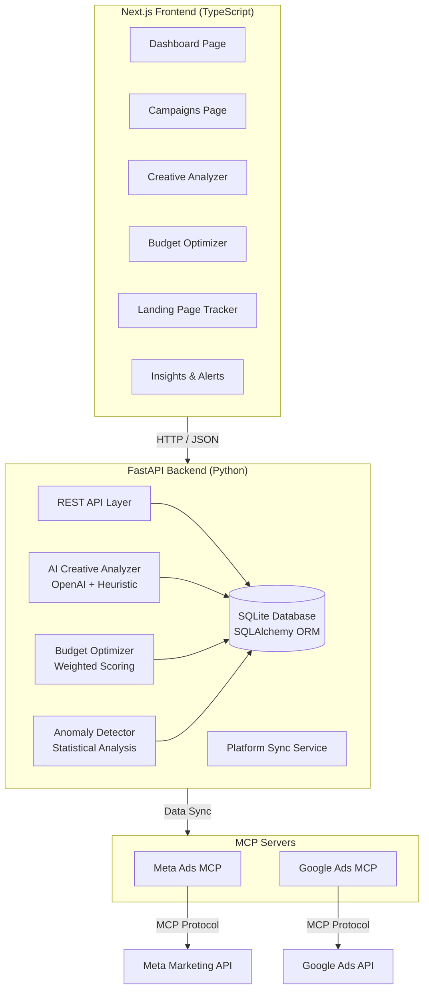

# CampaignPulse — AI-Powered Campaign Intelligence

> **Built for It's Today Media — $5,000 Build Challenge**
>
> *"Don't just buy media. Own it."*

## What is CampaignPulse?

CampaignPulse is an **AI-powered campaign intelligence platform** purpose-built for media buyers who manage ad spend across multiple platforms. It replaces the chaos of jumping between Google Ads, Meta Ads, Taboola, and TikTok dashboards with a **single pane of glass** — augmented by AI that analyzes creative performance, optimizes budget allocation, and detects anomalies before they cost you money.

### The Six Features

| # | Feature | What It Does |
|---|---------|-------------|
| 1 | **MCP Ad Platform Connectors** | MCP protocol servers for Meta Ads & Google Ads — extensible to all platforms |
| 2 | **Unified Campaign Dashboard** | Real-time KPIs, platform breakdowns, and performance charts across all campaigns |
| 3 | **AI Creative Analyzer** | Analyzes headlines, body copy, and CTAs against platform-specific best practices. Uses OpenAI for deep analysis, falls back to heuristic scoring |
| 4 | **Budget Optimization Engine** | Weighted scoring across ROAS, CPA, CTR, and conversion volume — reallocates budget to highest-performing campaigns |
| 5 | **Landing Page Performance Tracer** | Ties ad spend and click data directly to landing page conversion metrics |
| 6 | **Automated Anomaly Detection** | Scans for CPA spikes, ROAS drops, spend acceleration, and delivery issues — generates prioritized alerts |

---

## Why CampaignPulse?

### It's the difference between *spending* and *investing*

At It's Today Media, ROI is everything. Every dollar of ad spend needs to earn its place in the P&L. CampaignPulse was built around that single truth:

**For the Media Buyer:**
- Stop logging into 4+ dashboards every morning. See all campaigns in one view.
- Let AI tell you *which* creative elements are driving CPA, not just *that* a campaign is spending.
- Get notified when a metric drifts — before the quarterly review.

**For the Agency Owner:**
- The MCP architecture mirrors It's Today Media's existing AI tooling strategy.
- Every feature ties back to the core KPI: **list-building ROI**.
- The system is built to be extended — add a new platform connector in hours, not weeks.

### Architecture



### Tech Stack

```
Frontend     │  Next.js 16 + TypeScript (strict) + Tailwind CSS + Recharts
Backend      │  Python 3.12 + FastAPI + SQLAlchemy + SQLite
MCP Protocol │  Platform-specific MCP servers (Meta Ads, Google Ads)
AI Analysis  │  OpenAI GPT-4o-mini + heuristic fallback
Infrastructure │  Docker compose
```

---

## Getting Started

### Prerequisites

- Python 3.12+
- Node.js 22+
- Docker & Docker Compose (optional)

### 1. Quick Start (Local)

```bash
# Backend
cd backend
python -m venv .venv && source .venv/bin/activate
pip install -r requirements.txt
cp .env.example .env
uvicorn app.main:app --reload
```

```bash
# Frontend (separate terminal)
cd frontend
npm install
cp .env.example .env.local
npm run dev
```

Open **http://localhost:3000** — the backend seeds demo data automatically.

### 2. Docker

```bash
docker compose up --build
```

### 3. Setting Up AI Analysis

For advanced AI analysis (creative scoring, budget recommendations):
1. Get an [OpenAI API key](https://platform.openai.com/api-keys)
2. Add it to `backend/.env`:
   ```
   OPENAI_API_KEY=sk-...
   ```

Without an API key, the system falls back to heuristic analysis — all features still work.

---

## API Overview

| Endpoint | Method | Description |
|----------|--------|-------------|
| `/api/campaigns` | GET | List campaigns (with filtering, sorting, pagination) |
| `/api/campaigns/summary` | GET | Aggregate KPIs across all platforms |
| `/api/campaigns/sync` | POST | Trigger platform sync (generates mock data) |
| `/api/creatives` | GET | List creatives |
| `/api/creatives/analyze` | POST | AI-powered creative analysis |
| `/api/budget/recommendations` | GET | Budget allocation recommendations |
| `/api/landing-pages` | GET | Landing page performance data |
| `/api/insights` | GET | AI-generated insights and alerts |
| `/api/insights/scan` | POST | Run anomaly detection scan |
| `/api/platforms` | GET | Connected ad platforms |
| `/api/health` | GET | Health check |

---

## Project Structure

```
├── backend/
│   ├── app/
│   │   ├── main.py              # FastAPI app with seed data
│   │   ├── config.py            # Environment configuration
│   │   ├── database.py          # SQLAlchemy setup
│   │   ├── models/              # Campaign, Creative, AdPlatform, LandingPage, Insight
│   │   ├── schemas/             # Pydantic validation schemas
│   │   ├── routes/              # API route handlers
│   │   └── services/            # AI analyzer, budget optimizer, anomaly detector, sync
│   └── tests/                   # pytest test suite
├── frontend/
│   ├── app/                     # Next.js App Router pages
│   │   ├── campaigns/           # Campaigns list with filters
│   │   ├── creatives/           # Creative analysis page
│   │   ├── budget/              # Budget optimization page
│   │   ├── landing-pages/       # Landing page performance
│   │   └── insights/            # Insights and alerts
│   ├── components/              # UI components (shadcn-style)
│   │   ├── ui/                  # Card, Badge, Button, Tabs
│   │   ├── dashboard/           # Dashboard-specific components
│   │   └── layout/              # Nav sidebar, top bar
│   └── lib/                     # API client, types, utilities
├── mcp-servers/                 # MCP protocol server implementations
│   ├── base.py                  # Abstract MCP server
│   ├── meta_ads.py              # Meta Ads implementation
│   └── google_ads.py            # Google Ads implementation
├── docker-compose.yml
└── Dockerfile
```

---

## What I'd Build Next

Given a real production environment with live ad accounts, here's what CampaignPulse would evolve into:

### 1. Production Ad Platform Integration
The MCP servers currently return mock data. The next step is integrating with the actual APIs:
- **Meta Ads**: Facebook Marketing API via `facebook-business` SDK
- **Google Ads**: Google Ads API via `google-ads` Python client
- **Taboola & TikTok**: Native API integrations

### 2. Real-Time Streaming
Move from polling-based sync to real-time webhook receivers. Meta and Google both support webhook notifications for campaign changes. This would turn CampaignPulse from a dashboard into a command center.

### 3. Predictive Budgeting
The current optimizer is rules-based (weighted scoring). With historical data from real campaigns, I'd introduce:
- **Time-series forecasting** (Prophet/LightGBM) to predict CPA by hour/day
- **Auto-budgeting**: automatic daily budget adjustments based on performance windows
- **Cross-platform attribution**: which platform drives the best *list quality*, not just CPA

### 4. Creative A/B Testing Engine
Track creative variants at the platform level and automatically surface statistically significant winners — media buyers spend hours on creative decisions, and an AI that can say "Variant B wins at 95% confidence" saves real time.

### 5. Landing Page Deep Links
Connect landing page analytics (via a pixel or server-side tracking) back to individual ad placements. The question isn't "which landing page converts" but "which *audience + creative + landing page* combination drives the best email signup quality."

### 6. Competitive Intelligence
Track competitor ad spend and creative strategies using public APIs and ad library data. Knowing what your competitors are running gives media buyers asymmetric advantage.

### 7. Team Collaboration
Multi-user support with role-based access, shared dashboards, and Slack/Teams webhook integration for anomaly alerts.

---

## The Bottom Line

CampaignPulse is not a generic dashboard. It's a **media buyer's co-pilot** — built for the specific workflows, KPIs, and frustrations of affiliate marketing at scale. Every feature ties back to the question that matters: *"Is this dollar working harder than the alternative?"*

The MCP architecture aligns with It's Today Media's vision for AI tooling. The AI features are practical, not academic — they analyze what you're already doing and tell you what to do next. And the whole system is designed to be extended by one engineer who owns it end-to-end.

**That's the engineer we're looking for. This is what we'd build.**

---

*Built for the It's Today Media $5,000 Build Challenge · July 2026*
